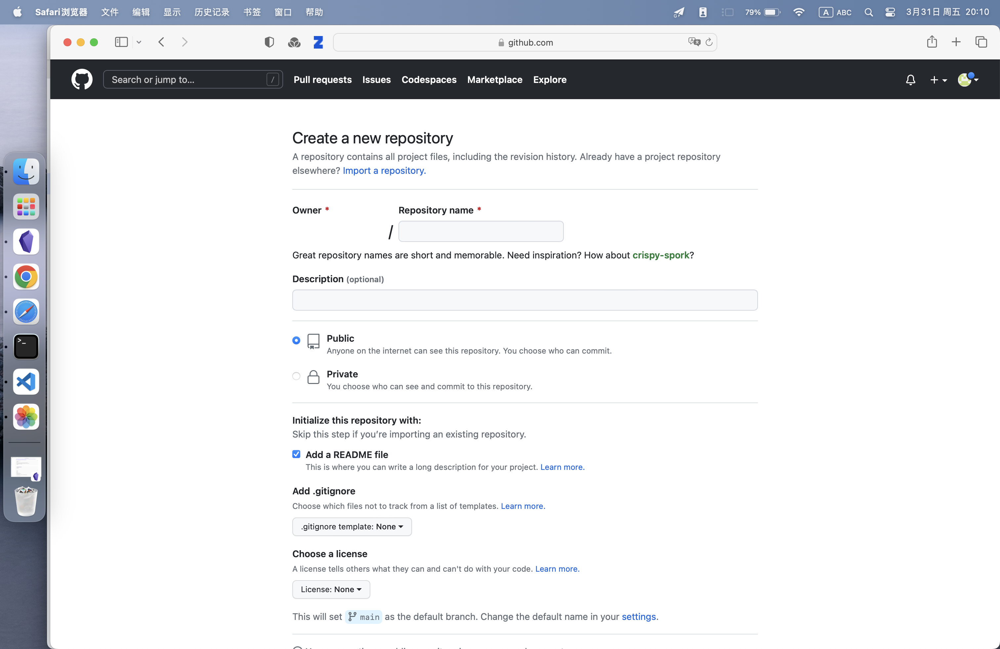
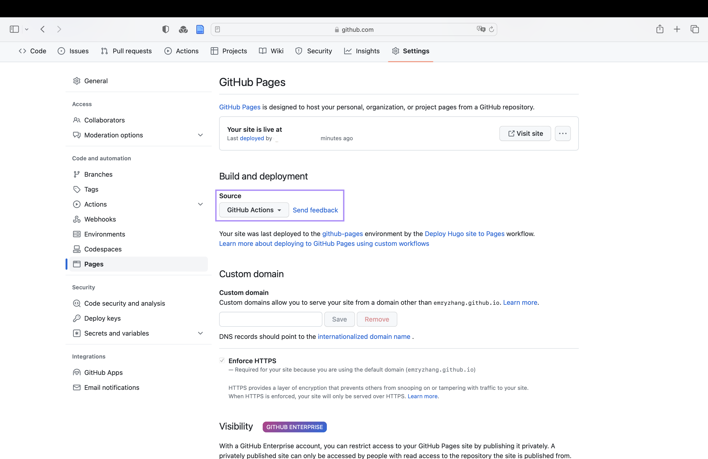
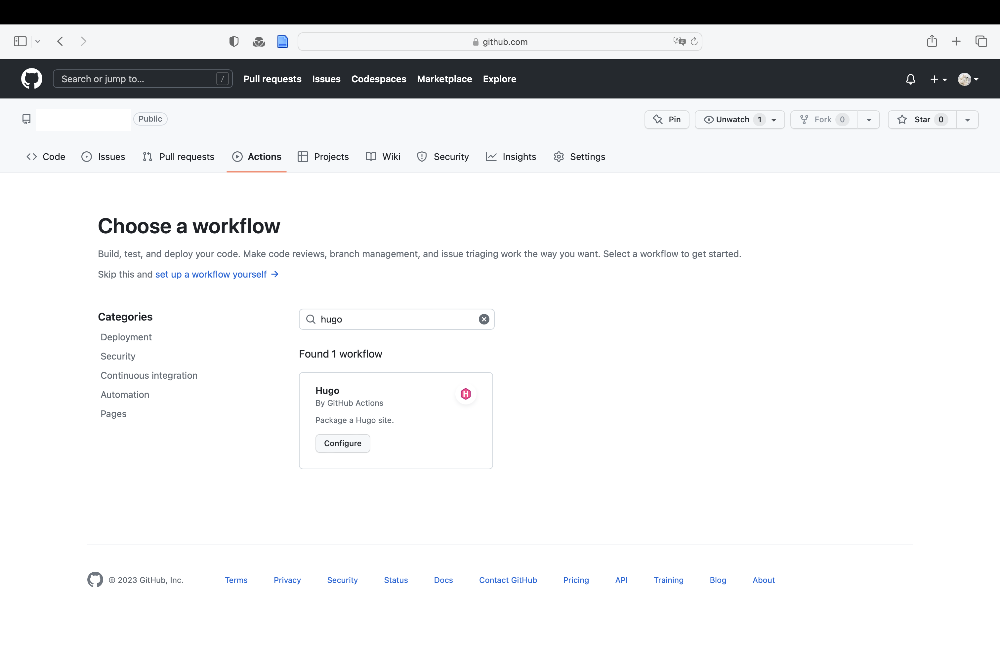
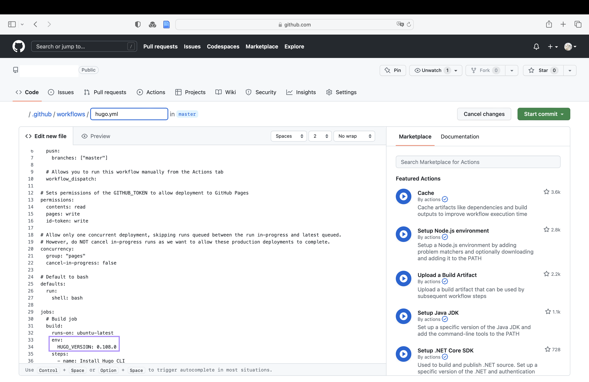
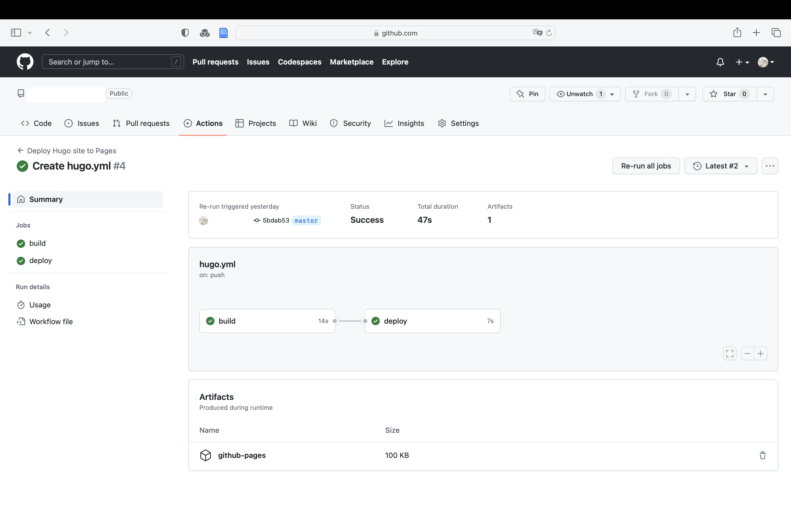

## 为什么要搭建这个博客
想拥有一个个人博客的最主要原因是想建立更健康的即时通讯工具使用方法，来恢复维持长时间注意力的能力（为什么建立有序的使用规则是有必要的可参考[《深度數位大掃除》](https://book.douban.com/subject/35002673/)），同时又能和朋友们保持联系。

现在流行的微信等即时通讯工具的主要功能有两个，微信聊天和微信朋友圈。

微信聊天总是带来碎片化的社交，尽管积少成多的短暂对话和点赞、评论确实能有效地表达关心和关注，进而维持并拉近和朋友们的关系，但碎片化同时也是割裂注意力的。并且由于“及时回复”成了一种需要被遵守的规定（因为不遵守是有可能会带来人际关系和经济上的后果的），有时就不得不随时查看新消息，那么这种对注意力的割裂又是被不断强化的。

而微信朋友圈尽管是一个个人发布信息的平台，但由于微信本身的社交属性，它实际上是一个完全面向他人的、不断地带来并且作为发布者不得不接受凝视和评价的平台。

因此，除了微信的用户范围几乎覆盖了所有人所以我不得不用这一点外，我没有任何一个个人理由想要用它，而现在，我正在积极地寻找它的可替代方法，以便实现原有的这些目的，又能逐渐摆脱它。

而个人博客对我来说是一个完全以自己为中心的平台，甚至可以关闭点赞、评论功能来屏蔽任何他人的看法。同时，我也有可能通过 newsletter 的方式，和朋友们保持微信之外的联系，让他们能够了解我的近况，维持我们的关系。

另外一个重要原因是看到很多人都有自己的博客，我就也超级想要这个玩具。

因此，这个博客就诞生了！

## 为什么选择 Hugo + Github Pages + Github Action 这个组合
答：方便又便宜。

Hugo 建站有非常非常多的教程，包括官方的以及个人创作者的分享，很多问题都不用自己摸索。

Github Pages 解决了域名的问题，让初次搭建博客的成本变低。Github Action 也是一样，让我不用付费去使用第三方托管平台。这些都让初次建站的难度、时间成本和花费尽可能地变低了。

（根据我自己的习惯，尽可能降低做一件事情预期的难度和成本，或者让过程中的乐趣远超过难度，能够让我更有动力开始着手做，也就是所谓的“没什么难的”、“不是什么大事”。）

更多博客搭建方案可参考：https://randomwaves.space/posts/personal-blog-solutions/
## 开始搭建博客
以 macOS 为例，流程非常简单，只有四步：
- 安装
- 建站
- 通过 Github Pages 托管
- 通过 Github Action 发布
### 安装
#### 通过 MacPorts 安装 Hugo
根据[官方文档](https://gohugo.io/installation/macos/)，安装 hugo 有三种方式，package managers、Docker 和 build from source（windows 和 linux 也可以通过[下载](https://github.com/gohugoio/hugo/releases/latest)解压的方式直接下载到本地），其中 package managers 最简单，我是用的其中的 MacPorts，如下：
``` markdown
sudo port install hugo
```
#### 安装 git

``` markdown
sudo port install git
```
参考链接：[installGit](https://git-scm.com/book/en/v2/Getting-Started-Installing-Git)、[download/mac](https://git-scm.com/download/mac)
### 建站

#### 语句
``` markdown
hugo new site quickstart //建站, 运行后会得到一个名为 quickstart 的文件夹
cd quickstart //打开所在文件夹，也可以使用 cd "path"
git init //初始化 git
git submodule add https://github.com/CaiJimmy/hugo-theme-stack themes/hugo-theme-stack //拷贝主题
echo "theme = 'stack'" >> config.toml //配置 config.toml
```
#### 配置 ```config.toml```
在一些教程中，我看到配置的方法是把``` hugo-theme-stack - exampleSite - config.yaml ``` 复制到``` quickstart - config.toml ```里去，因此我设想``` echo "theme = 'stack'" >> config.toml```也是能实现这个效果，但是并没有，最后还是手动粘贴进去再改后缀完成的。
#### 参考链接
- [官方快速开始指南](https://gohugo.io/getting-started/quick-start/)
- [hugo 主题一览](https://themes.gohugo.io)
- [如何使用 hugo+github pages 搭建一个个人博客](https://ednovas.xyz/2021/07/20/hugo/#注意问题)
- [[Hugo] Hugo的基本安装｜网站生成｜托管至Github Pages](https://zhuanlan.zhihu.com/p/350977057)
- stack 主题
	- https://github.com/CaiJimmy/hugo-theme-stack
	- https://stack.jimmycai.com/guide/getting-started
### 通过 Github Pages 托管
#### 新建和设置 repository
- 新建一个 repository，注意需要选上 README.md，名称可以以```username.github.io```的格式命名
- 在 setting - pages 中设置 source 为 GIthub Actions

#### 托管至 Github Pages
在完成第一项后，你就得到了一个格式为 ```https://username.github.io``` 的 URL，首先需要在``` quickstart - config.toml ```把 ```baseURL``` 的位置改为这个 URL。后续的语句为：
``` markdown 
cd quickstart //打开所在文件夹，也可以使用 cd "path"
git init
git add .
git branch -M master
git commit -m 'initial commit' //可自定义注释
git remote rm origin
git remote add origin https://username.github.io.git
git push -u origin master
```
运行后，会要求你输入 github 的账号和密码，此时密码输入平时登陆用的密码会报错，需要输入 [personal token](https://docs.github.com/en/authentication/keeping-your-account-and-data-secure/creating-a-personal-access-token)，设置路径为 ```Account Settings - Developer Settings - Personal access tokens - Tokens(classic)```。
运行成功后，就会发现在 repository 出现了一个新的分支 master，本地 quickstart 文件夹里的所有文件都会出现在里面，此时托管这一步就成功了。
### 通过 Github Action 发布
在使用 Github Action 之前，我用了几次在本地生成 public 文件夹，然后 push 这个文件夹到 github repository 的方法，和用 GIthub Action 发布的方法相比，由于每次需要多几行代码，所以还是后者更方便一点，并且配置也十分得简单。
首先，在博客所在的 repository 页面，点击 Pages，将 Source 修改为 Github Actions。

其次，在博客所在的 repository 页面，点击到 ```Actions - New workflow```，搜索 Hugo，点击 Configure 开始设置。

点开后，Hugo 的配置文件 hugo.yml 就已经出现了，只需修改其中的 Hugo version 即可。version 可在 terminal 中查看：
``` markdown
hugo version
```

修改后，点击 start commit 即可。
开始运行后，可以在 Actions 界面看到运行情况，成功后，后续在本地将更新的内容 push 到 github 后就会开始自动更新了。

## 开始写博客
```
hugo new post/xxx.md //新建博客文章
```  
此时，content 文件夹中会新建 post 文件夹，并新建名为 xxx 的 md 文档，文档会有一些前置参数：
```
---
title: "" //文章标题
date: //写作日期
lastmod: //最后一次修改日期
draft: false //是否为草稿，是的话不会展示在发布后的界面中，但会展示在本地界面中
---
```
其他常用的有：
```
---
subtitle: //文章副标题
description: //文章描述
tags: //标签
categories: //分类
hidden: //是否隐藏，是的话不会展示在发布后的界面中，但可以通过文章链接访问
featuredImage: //文章题图
featuredImagePreview: //预览界面文章题图
toc: //是否显示右侧目录
---
```
更多的可参考：[# hugo搭建个人博客2-文章写作](https://shuzang.github.io/2019/hugo-blog-article-write/)
文章创建的模版在 ```archetypes - default.md```中，可在其中添加自己需要的参数。
完成写作后，在 terminal 中通过如下语句将更新内容 push 到 github 里，Github Actions 就会完成自动更新，点开博客链接就能看到内容啦。
``` markdown
git add xxx.md
git commit -m 'update xxx.md'
git push
```
## 其他常用语句
```markdown
git remote -v //查看分支链接
git branch -a //查看远程分支
git remote remove origin //删除远程分支 origin
```
